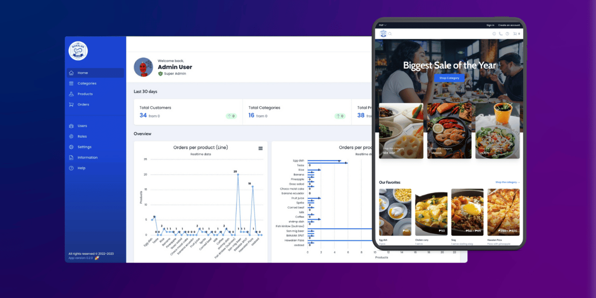

# ✨ Application Features

<!-- display image here from public folder cover.png -->
<!-- <kbd>
  
</kbd> -->

<kbd>
  
</kbd>

## 👱 Types of User

- [X]  Admin
  - [X]  Kitchen manager
  - [X]  Deliver Boy
  - [X]  Dynamic roles
- [X]  Customer

---

## 👱 User Interface

**Landing Page**

- [X]  Ability to display all the food and services
- [X]  Create account upon checkout
- [X]  Login account

**About us**

- [X]  Contacts info

**Customer Account**

- [X]  List of product

- Categories

- [X]  Profile
- [X]  My orders
- [X]  My addresses
- [X]  Ability to add orders

- COD
- Online Payment (GCASH)

**Admin Account**

- [X]  Dashboard
  - [X]  Summary (last 30 days)
  - [X]  Overview charts
  - [X]  Recent activity table
- [X]  Categories ✅
  - [X]  Create
  - [X]  Read
  - [X]  Update
  - [X]  Delete
- [X]  Products ✅
  - [X]  Create
  - [X]  Read
  - [X]  Update
  - [X]  Delete
- [X]  Orders ✅
  - [X]  Read
  - [X]  Update
  - [X]  Delete
- [X]  users ✅
  - [X]  Create
  - [X]  Read
  - [X]  Update
  - [X]  Delete
- [X]  roles ✅
  - [X]  Create
  - [X]  Read
  - [X]  Update
  - [X]  Delete
- [X]  orders (status)

- New orders
- Under process orders
- Out to deliver orders
- Delivered orders
- Cancelled orders

**Delivery boy**

- Ability to view and manage delivery status

**Kitchen manager**

- Ability to view and manage delivery status
- Ability to manage all orders

---

## 🛠️ Settings

- [X]  Profile
- [X]  Address
- [X]  Logout

---

## 👨‍🔬 Misc. Features

- [X]  Realtime notification
- [X]  Realtime events

---

## 🚀 Deployment

- `Domain name` - https://ronaldscatering.com/
- `Hosting platform` - [Laravel Forge](https://forge.laravel.com/)
- `Server platform` - [Digital Ocean](https://www.digitalocean.com/)

## ℹ️ Demo

<b>Links<b>

- `Admin` - https://ronaldscatering.com/admin
- `Customer` - https://ronaldscatering.com/

<b>Admin Credentials<b>

- `Email` - admin@test.com
- `Password` - password

## 🚧 Installation

1. Clone the repository

```bash
  git clone https://github.com/Phojie/restaurant-management-system.git
  cd restaurant-management-system
```

2. Install the dependencies

```bash
  composer install
  yarn install 
```

3. Copy the example env file and make the required configuration changes in the .env file

```bash
  cp .env.example .env
```

4. Generate a new application key and optimize the application

```bash
  php artisan key:generate && php artisan optimize
```

5. Run the database migrations (Set the database connection in .env before migrating) ⚠️ This DB is designed based on PGSQL

```bash
  php artisan migrate --seed
```

6. Create a symbolic link from "public/storage" to "storage/app/public"

```bash
  php artisan storage:link
```

7. Start the local development server (Vue)

```bash
  yarn dev
```

8. Start the local development server (Laravel)

```bash
  php artisan serve
```

You're ready to go! Visit in your browser (e.g. http://localhost:8000), and login with:

- **Username:** admin@test.com
- **Password:** password

## 🧪 Running tests

🚧 **Note:** Tests are still in development. 🚧

To run the tests, run:

```bash
php artisan test
```
